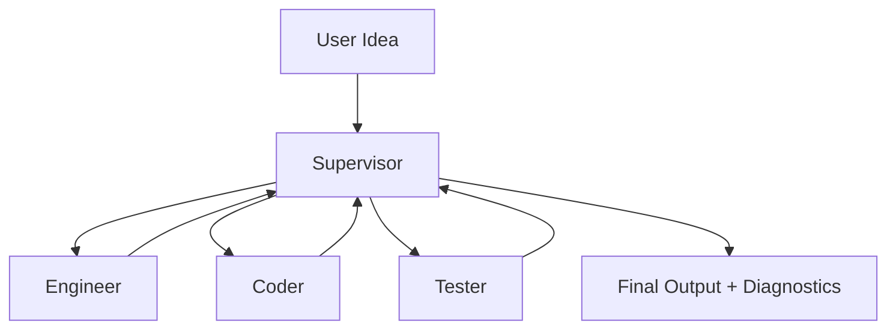

# MetaForge

[](https://opensource.org/licenses/MIT)
[](https://www.python.org/)
[]()
[]()
[]()

MetaForge transforms a natural language software idea into a runnable multi-module Python project using a coordinated team of LLM-powered agents. It is designed to fail gracefully: when the LLM cannot produce production-quality code, the system detects this and deliberately halts the project, ensuring that no broken code is ever delivered.

### Why MetaForge?

Unlike simple AI wrappers that ask one model to generate an entire project, MetaForge introduces a structured software-engineering pipeline. The system decomposes the task into specialized agents (Supervisor, Engineer, Coder, and Tester) that collaborate through a message-passing architecture. This design prioritizes reliability, observability, and controlled failure over pure generation speed.

### How It Works



### Key Features

- **Multi-Agent Architecture**: Specialized agents (Supervisor, Engineer, Coder, Tester) collaborate through a message channel.
- **LLM-Powered Generation**: Uses real LLM calls to design and implement software projects.
- **Intelligent Fallback System**: Automatically detects LLM failures and gracefully terminates the process instead of producing broken code.
- **Built-in Diagnostic System**: Provides detailed step-by-step analysis when issues occur.
- **End-to-End Automation**: From idea to validated project with minimal human intervention.
- **Extensible Design**: Clean separation of concerns with dependency injection and modular components.

### Installation & Usage

```bash
git clone https://github.com/PyAimind/MetaForge.git
cd MetaForge

pip install -r requirements.txt
```

Create a `.env` file in the root directory:

```env
DEEPSEEK_API_KEY=your_api_key_here
```

Run the system:

```bash
python main.py
```

### Example Runs

| Project Idea                          | Result                     | Notes |
|---------------------------------------|----------------------------|-------|
| Simple Calculator                     | ✅ Completed              | Two clean and functional modules generated |
| Temperature Converter with CLI        | ⚠️ Completed with limitations | LLM produced some structural duplication in modules |
| Simple Calculator (no internet)       | ✅ Gracefully Failed      | System correctly triggered fallback mechanism |

### Current Limitations

MetaForge validates syntax, execution, and workflow integrity. However, the semantic quality and architectural structure of the generated project still heavily depend on the underlying LLM. In complex projects, the model may occasionally produce redundant logic or suboptimal module separation. These limitations are inherent to current LLM technology and are active areas of improvement for future MetaForge versions.

### Project Structure

```
MetaForge/
├── main.py
├── agents/
│   ├── supervisor.py
│   ├── engineer.py
│   ├── coder.py
│   └── tester.py
├── communication/
│   ├── message.py
│   └── message_channel.py
├── workspace/
│   └── workspace_manager.py
├── project_design/
│   ├── structure_designer_llm.py
│   ├── code_generator_llm.py
│   ├── prompt_generator.py
│   └── code_executor.py
├── llm_provider.py
├── diagnostics/
│   ├── common.py
│   └── diagnose.py
├── tests/
│   └── diagnostic/
├── output/                 # generated projects
├── requirements.txt
├── .env
└── config.py
```

### Roadmap

- ✅ **v1.0** — Simulated agents with mock responses
- ✅ **v2.0** — Full LLM-powered agents + Fallback + Diagnostics
- ⬜ **v3.0** — Agent Memory & Context Sharing
- ⬜ **v3.0** — Parallel Coding + Agent Debate
- ⬜ **v3.0** — Self-Repair Loop
- ⬜ **v3.0** — Web Interface

### Version History

- **v1.0** — Simulated agents with mock responses (June 2026)
- **v2.0** — Full LLM-powered agents with real API integration, fallback detection, and diagnostic system (July 2026)

### License

This project is licensed under the MIT License.
