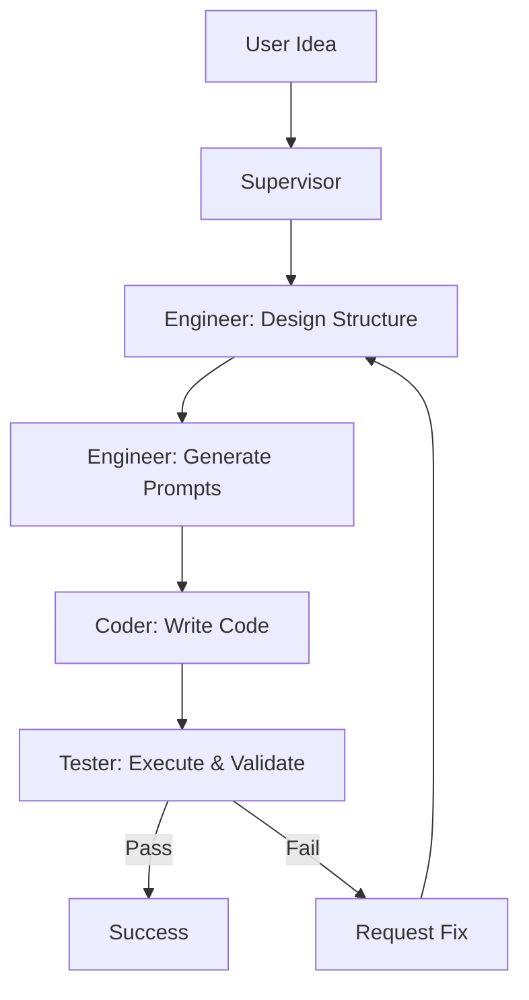

# MetaForge

**A self-organizing multi-agent system that autonomously designs, codes, and tests complete Python projects** — powered by a custom Muscular Prompt Engineering methodology.

MetaForge simulates a real engineering team using four specialized agents that collaborate through structured message passing to turn a high-level idea into a fully working, tested Python application.

---

## 🚀 Live Demo

MetaForge successfully designed, coded, and tested a simple calculator project from scratch:

```
output/
├── main.py
├── input_handler.py
└── calculator.py
```

Run `main.py` inside the `output/` folder to see the working calculator.

---

## Why MetaForge?

Most people use AI tools to generate isolated code snippets.  
MetaForge goes further: it creates an **entire software project** — including structure design, code generation, testing, and error recovery — using a disciplined, repeatable process.

This project was built to explore whether a multi-agent system can replicate a real software engineering workflow with high reliability and traceability.

---

## Key Features

- **Zero external dependencies** — Built entirely with Python standard library
- **Phased & incremental development** with accumulative testing
- **Secure code execution** with timeout protection and path validation
- **Stateful orchestration** using a central Supervisor agent
- **Muscular Prompt Engineering** methodology for consistent, high-quality outputs
- Clean Conventional Commits and professional project structure

---

## Architecture

MetaForge consists of four specialized agents that communicate through a queue-based message channel:

| Agent       | Role                                      | Responsibility |
|-------------|-------------------------------------------|----------------|
| **Supervisor**  | Central orchestrator (State Machine)     | Manages the full workflow and coordinates all agents |
| **Engineer**    | Project architect & prompt engineer      | Breaks down the idea into phases and generates precise prompts |
| **Coder**       | Code generator                           | Writes clean, functional code based on Engineer prompts |
| **Tester**      | Quality assurance                        | Executes code securely, validates results, and reports issues |

### Workflow



---

## Development Process

MetaForge was developed using a strict **phased, incremental, and test-driven methodology**. Every major component was built, tested, and committed separately to ensure high quality and traceability.

### Development Phases

| Phase | Focus Area                        | Highlights |
|-------|-----------------------------------|----------|
| 0–1   | Project Setup & Workspace         | Config, WorkspaceManager, JSON state handling |
| 2     | Communication Layer               | Immutable Message dataclass + Queue-based MessageChannel |
| 3     | Coder Agent                       | Simulated code generation + deep validation tests |
| 4     | Tester Agent                      | Secure subprocess execution, path validation, timeout handling |
| 5     | Engineer + Prompt Engineering     | Deterministic structure designer + Muscular prompt generator |
| 6     | Supervisor & Main Loop            | State machine orchestrator + full workflow + error recovery |

**Total:** 36+ commits following Conventional Commits standards.

This disciplined development approach is the same methodology that MetaForge itself automates.

---

## Project Structure

```
MetaForge/
├── main.py                      # Main entry point
├── agents/
│   ├── supervisor.py            # Central state machine orchestrator
│   ├── engineer.py              # Structure design + muscular prompt generation
│   ├── coder.py                 # Code generation from prompts
│   └── tester.py                # Secure code execution and validation
├── communication/
│   ├── message.py               # Immutable Message dataclass
│   └── message_channel.py       # Queue-based inter-agent communication
├── workspace/
│   └── workspace_manager.py     # JSON-based state and logging manager
├── project_design/
│   ├── structure_designer.py    # Phase and module breakdown
│   └── prompt_generator.py      # Muscular prompt generator
├── output/                      # Auto-generated projects
│   ├── calculator.py
│   ├── input_handler.py
│   └── main.py
└── tests/                       # Unit and integration tests
```

---

## Getting Started

```bash
git clone https://github.com/PyAimind/MetaForge.git
cd MetaForge
python main.py
```

After running, check the `output/` folder for the generated project.

**Requirements:** Python 3.10+

---

## Challenges & Key Learnings

- Designing a reliable state machine for the Supervisor without overcomplicating the architecture
- Preventing prompt leakage and safely extracting code from LLM-style responses
- Building accumulative tests that validate new modules together with previous ones
- Maintaining strict separation of concerns between agents while keeping the system simple
- Handling real-world issues like timeouts, path traversal attacks, and corrupted state files

These challenges helped shape both the final system and the underlying Muscular Prompt Engineering methodology.

---

## Future Roadmap

- **v2.0**: Connect Engineer and Coder to real LLM APIs (DeepSeek, Gemini, etc.)
- **v3.0**: Add automatic multi-round error recovery without human intervention
- **v4.0**: Support for multiple programming languages and more complex project types

---

## License

This project is licensed under the MIT License — see the [LICENSE](LICENSE) file for details.

**Note:** While the code is open source, the core "Muscular Prompt Engineering Methodology" and system design are the result of original research and development.

---

**Built with ❤️ at 16 years old**  
Exploring the future of autonomous software engineering.
