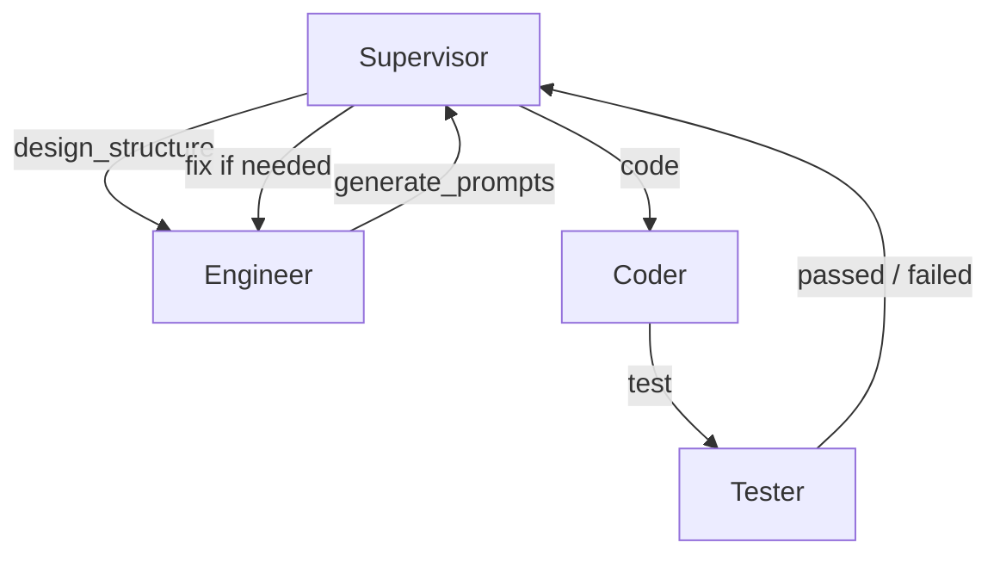

# MetaForge

**A multi-agent AI system that autonomously designs, builds, and tests complete Python projects.**

MetaForge is a multi-agent AI system that can take a high-level project idea and independently design its architecture, generate code, test it, and fix errors — all with minimal human intervention. It is powered by a custom **Muscular Prompt Engineering Methodology**.

---

## 🚀 Demo

Running `main.py` with a project idea causes MetaForge to autonomously build a working Python project.

For example, giving it the idea **"Simple Calculator"** results in multiple Python files that form a fully functional calculator.

```bash
python main.py
```

After execution, generated files will be available in the output directory.

---

## 🎯 Motivation

Most developers use AI to write small pieces of code. However, building a complete, well-structured, and tested project still requires significant manual effort and coordination.

MetaForge explores a different question:  
**What if multiple specialized AI agents could work together like a real software development team?**

---

## 🏗️ Architecture

MetaForge consists of four specialized agents that communicate through a message channel and share state via a workspace:

| Agent        | Role                        | Responsibility                                      |
|--------------|-----------------------------|-----------------------------------------------------|
| **Supervisor** | Project Coordinator         | Manages workflow, state, and coordinates other agents |
| **Engineer**   | Prompt Engineer & Architect | Designs project structure and creates high-quality prompts |
| **Coder**      | Code Generator              | Writes actual Python code based on received prompts   |
| **Tester**     | Quality Assurance           | Tests the generated code and reports results          |

---


## 🛠️ Tech Stack

- **Language**: Python
- **Communication**: Custom queue-based MessageChannel
- **State Management**: File-based WorkspaceManager
- **Prompt Engineering**: Custom Muscular Prompt Methodology
- **Architecture**: Multi-agent system with clear role separation


---

### Workflow



The system follows an iterative process: Design → Prompt Generation → Coding → Testing → Fixing (if needed).

---

## 🧠 Methodology

MetaForge is built on a custom **Muscular Prompt Engineering Methodology** that was developed and validated through real project development. 

This methodology focuses on writing highly precise, contract-style prompts that minimize ambiguity and hallucination. It emphasizes incremental development, accumulative testing, and strict constraints on code structure and library usage. This approach allows multiple AI agents to collaborate reliably without direct human intervention in every step.

---

## ✨ Key Features

- Autonomous end-to-end project building
- Stateful coordination between agents
- Automatic error recovery through prompt fixing
- Clean modular architecture using message passing
- Generates real, runnable Python code

---

## ▶️ How to Run

```bash
git clone https://github.com/pyaimind/MetaForge.git
cd MetaForge
python main.py
Note: The project idea is currently hardcoded inside main.py. You can change the idea string to generate different types of projects.

---

## Project Structure
MetaForge/
├── main.py                      # Main entry point of the system
├── agents/
│   ├── supervisor.py            # Central orchestrator (State Machine)
│   ├── engineer.py              # Designs project structure and generates muscular prompts
│   ├── coder.py                 # Writes code based on the generated prompts
│   └── tester.py                # Executes code and validates results
├── communication/
│   ├── message.py               # Immutable Message dataclass
│   └── message_channel.py       # Queue-based message passing system
├── workspace/
│   └── workspace_manager.py     # Manages JSON state files (logs, test results, current phase)
├── project_design/
│   ├── structure_designer.py    # Breaks down the idea into phases and modules
│   └── prompt_generator.py      # Generates precise muscular prompts for the Coder
├── output/                      # Auto-generated projects by the system
│   ├── calculator.py
│   ├── input_handler.py
│   └── main.py
└── tests/                       # Unit and integration tests for all modules
**Short Explanation:**

The `output/` folder contains the final working projects that MetaForge automatically designs, codes, and tests. Currently, it includes a simple calculator example as a proof of concept.

---

## 🧩 Challenges & Learnings

Developing MetaForge involved several key technical challenges:

- Designing a clean and maintainable state machine for the Supervisor
- Managing communication and shared state between independent agents
- Creating precise prompts that reduce hallucinations while remaining effective
- Implementing reliable error recovery between Coder, Tester, and Engineer
- Balancing agent autonomy with overall system control

These challenges led to a more robust architecture and a deeper understanding of multi-agent system design.

---

## 🔮 Future Improvements

- Integration with real LLM APIs (e.g. DeepSeek, Claude, GPT)
- Advanced error analysis and autonomous self-correction
- Support for larger and more complex projects
- Prompt optimization through feedback loops
- External tool and library integration

---

## 📌 Conclusion

MetaForge shows that with structured prompt engineering and well-defined agent roles, multiple AI agents can collaborate to build real software projects. It represents a meaningful step toward more autonomous AI-assisted software development.

---

## 📜 License & Usage Notice

This project is released under the **MIT License**.

While the license permits commercial use, this project was developed as part of personal research and learning. I kindly ask that you **do not sell or redistribute this work as your own** without permission. If you use parts of this project in your own work, proper attribution would be appreciated.

---

## 📬 Contact

For questions about the methodology or potential collaboration, feel free to reach out.

---

**Made with curiosity and persistence.**
