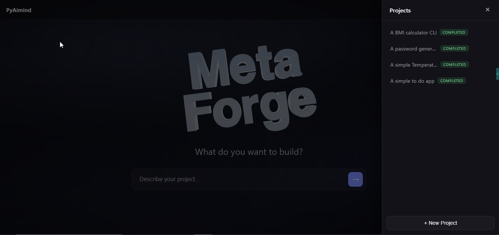
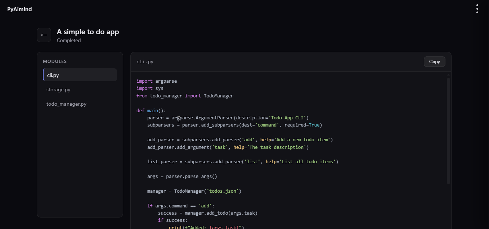
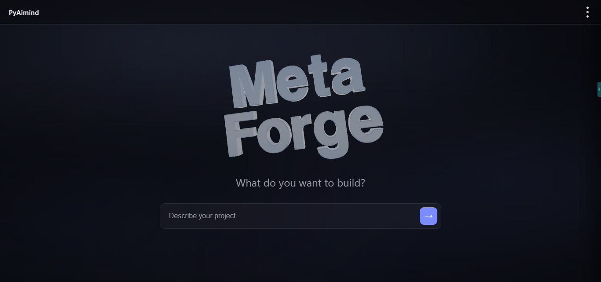
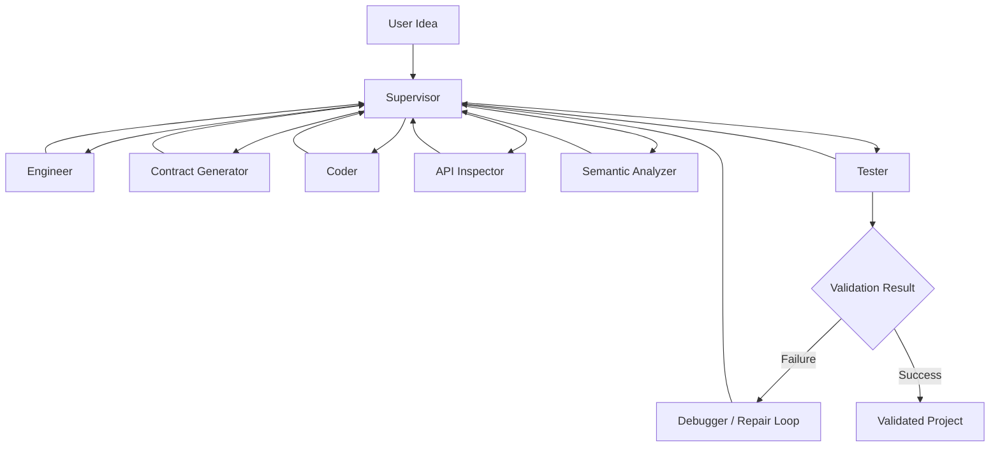

# MetaForge

[](https://opensource.org/licenses/MIT)
[](https://www.python.org/)
[]()
[]()
[]()

MetaForge transforms a natural-language software idea into a runnable multi-module Python project using a coordinated team of LLM-powered agents.

**New in v4.0:** a desktop UI with a live timeline, project history, and a code viewer.


---

## Why MetaForge?

Unlike simple AI wrappers that ask a single model to generate an entire project, MetaForge uses a structured multi-agent architecture where different agents are responsible for different stages of the software-development process.

The system combines project design, contract-driven generation, structural inspection, semantic analysis, runtime testing, diagnostics, and self-repair into a single workflow.

The core philosophy is:

> **Generation is not enough. A generated project should be inspected, tested, repaired when necessary, and validated before completion.**

---

## The v4.0 UI

MetaForge v4.0 adds a full desktop UI while keeping the CLI pipeline intact.

### Live Timeline

Watch every step in real time — from understanding the idea to running acceptance tests. Human-readable events replace technical jargon.


### Project History

Every project is saved locally with its full history. Reopen any project to inspect its modules, thinking log, and generated code.



### Code Viewer

Browse every generated module with syntax highlighting and one-click copy.



### Home Screen

A minimal entry point with a two-layer drifting fog background and a real-time Three.js glass logo. When a project starts, the hero shrinks smoothly and a live timeline expands below it.



---

## How It Works


```mermaid
flowchart TD
    A[User Idea] --> B[Supervisor]
    B --> C[Engineer]
    C --> B
    B --> D[Contract Generator]
    D --> B
    B --> E[Coder]
    E --> B
    B --> F[API Inspector]
    F --> B
    B --> G[Semantic Analyzer]
    G --> B
    B --> H[Tester]
    H --> B
    H --> I{Validation Result}
    I -->|Failure| J[Debugger / Repair Loop]
    J --> B
    I -->|Success| K[Validated Project]
```

MetaForge coordinates these stages through a message-passing architecture. The Supervisor controls the overall workflow and determines when a project is ready for completion or requires another repair cycle.

---

## Version 4.0

Version 4.0 introduces a complete UI layer on top of the existing MetaForge pipeline.

Main improvements:

- **FastAPI backend** with REST endpoints and WebSocket streaming
- **Live timeline** of every run, streamed in real time
- **Project history** with persistent storage per project
- **Code viewer** with syntax highlighting and copy support
- **Dark theme** with a two-layer drifting fog background and a Three.js glass logo
- **Modular frontend** built with pure HTML, CSS, and vanilla JavaScript
- **No framework required** — no bundler, no build step
- **Works offline** — all dependencies vendored locally

The CLI pipeline from v3.3 remains completely unchanged.

---

## Key Features

- **Multi-Agent Architecture** — Supervisor, Engineer, Coder, and Tester collaborate through a message-driven workflow.
- **Contract-Driven Generation** — public module APIs are defined before implementation.
- **API Inspection** — generated modules are checked against their declared public APIs.
- **Semantic Analysis** — cross-module compatibility is analyzed beyond structural validation.
- **Generic Acceptance Testing** — Tester runs project-level acceptance tests without hardcoded project assumptions.
- **Multi-Module Repair** — runtime failures can be analyzed in the context of multiple related modules.
- **Isolated Testing** — acceptance tests run in controlled environments with a shared temporary directory.
- **Real-Time UI** — every event is streamed to the UI via WebSocket.
- **Persistent History** — every project is stored with metadata, thinking log, and generated modules.
- **Atmospheric Background** — Two-layer drifting fog rendered with CSS gradients, plus a real-time Three.js glass logo.
- **End-to-End Automation** — the complete workflow runs from a natural-language idea to validated generated code.

---

## Example Runs

| Project Idea | Result | Notes |
|---|---|---|
| Simple to do app | ✅ Completed | Multi-module analysis, repair, and acceptance testing |
| Simple Temperature Converter CLI | ✅ Completed | Deterministic CLI with acceptance tests |
| Simple password generator CLI | ✅ Completed | Random-output CLI validated by return code |
| File organizer CLI | ⚠️ Limited | File-system acceptance tests require fixture support (planned) |

The Todo application has been the primary validation scenario across versions.

---

## Installation & Usage

### Requirements

- Python 3.10+
- A DeepSeek-compatible API key (or a compatible LLM provider)

### Setup

```bash
git clone https://github.com/PyAimind/MetaForge.git
cd MetaForge
pip install -r requirements.txt
```

Create a `.env` file in the root directory:

```env
DEEPSEEK_API_KEY=your_api_key_here
LLM_BASE_URL=https://api.deepseek.com/v1/chat/completions
MAX_LLM_REQUESTS=40
LLM_ENGINEER_MODEL=deepseek/deepseek-chat-v3.1
LLM_CODER_MODEL=deepseek/deepseek-chat-v3.1
```

### Running the CLI

```bash
python main.py
```

Enter a natural-language software idea when prompted:

```
A simple to do app
```

### Running the UI

```bash
python run_ui.py
```

Then open `http://127.0.0.1:8765` in a browser.

The UI provides:

- Live timeline of every run
- Project history with persistent storage
- Code viewer for generated modules
- Dark theme with a two-layer drifting fog background and a Three.js glass logo

---

## Project Structure

```
MetaForge/
├── main.py                  CLI entry point
├── run_ui.py                UI server launcher
├── config.py
├── llm_provider.py
│
├── agents/                  Core agents (Supervisor, Engineer, Coder, Tester, ...)
├── communication/           Message and event infrastructure
├── project_design/          Structure design, prompts, contracts, code execution
├── workspace/               Runtime state during a run
├── memory/                  Knowledge base
│
├── ui/                      v4.0 UI layer
│   ├── server.py            FastAPI server
│   ├── runner.py            Subprocess manager and event broadcaster
│   ├── static/              Frontend (HTML, CSS, JS, vendored libraries)
│   └── __init__.py
│
├── projects/                Persistent project storage (per-project folders)
├── docs/                    Screenshots, demos, documentation
│   ├── screenshots/
│   └── demos/
│
├── tests/                   Unit, integration, and diagnostic tests
├── output/                  Generated modules of the last run
│
├── requirements.txt
├── .env
└── README.md
```

---

## Current Limitations

MetaForge is still an LLM-driven software-generation system and cannot guarantee correct generation for arbitrary ideas.

Known limitations:

- Acceptance tests for file-system operations require fixture support (planned).
- Complex multi-module interactions may still fail under certain acceptance tests.
- The underlying LLM is non-deterministic; identical ideas can produce different structures.
- Semantic analysis depends on the quality of available context.
- Repair loops are bounded by configured attempt limits.
- The Three.js glass logo uses a procedural environment map, not a real HDRI. Reflections are approximated for performance and portability.

---

## Roadmap

- ✅ **v1.0** — Simulated agents with mock responses
- ✅ **v2.0** — Full LLM-powered agents, fallback handling, and diagnostics
- ✅ **v3.0-beta** — Context Manager, Debugger, Knowledge Base, Self-Repair Loop
- ✅ **v3.1** — Contract Generator, Contract-Aware Coder, API Inspector
- ✅ **v3.2** — Semantic Analysis, multi-module repair, isolated acceptance testing
- ✅ **v3.3** — Generic Acceptance Testing, entrypoint-aware validation
- ✅ **v4.0** — Desktop UI with a live timeline, project history, and a code viewer
- ⬜ **v4.1** — Fixture-aware acceptance tests
- ⬜ **v4.2** — Error handling UI, pause/resume, checkpointing
- ⬜ **v5.0** — Web deployment and multi-project runtime

---

## Version History

- **v4.0** — Desktop UI with a live timeline, project history, and a code viewer
- **v3.3** — Generic acceptance testing engine and entrypoint-aware validation
- **v3.2** — Semantic Analysis, improved multi-module repair, isolated acceptance testing
- **v3.1** — Contract Layer, `contracts.json`, Contract-Aware Coder, API Inspector
- **v3.0-beta** — Context Manager, Debugger, Knowledge Base, Self-Repair Loop
- **v2.0** — Full LLM-powered agents with real API integration and diagnostics
- **v1.0** — Simulated agents with mock responses

---

## Previous Versions

Detailed architecture documentation for earlier versions is preserved in their respective release tags:

- [v3.3 — Generic Acceptance Testing](https://github.com/PyAimind/MetaForge/releases/tag/v3.3)
- [v3.2 — Semantic Analysis & Isolated Testing](https://github.com/PyAimind/MetaForge/releases/tag/v3.2)
- [v3.1 — Contract Layer & API Inspector](https://github.com/PyAimind/MetaForge/releases/tag/v3.1)
- [v3.0-beta — Self-Repair Infrastructure](https://github.com/PyAimind/MetaForge/releases/tag/v3.0-beta)

For the current architecture, see the sections above.

---

## Technical Documentation

For detailed architecture, internal workflows, repair-loop behavior, and implementation details, see:

[TECHNICAL.md](TECHNICAL.md)

---

## License

This project is licensed under the MIT License.
```

---
