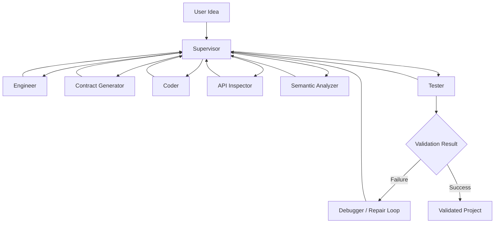

# MetaForge

[](https://opensource.org/licenses/MIT)
[](https://www.python.org/)
[]()
[]()
[]()

MetaForge transforms a natural-language software idea into a runnable multi-module Python project using a coordinated team of LLM-powered agents.

It is designed as an automated software-engineering pipeline that can design, generate, inspect, test, diagnose, repair, and validate generated projects before declaring them complete.

---

## Why MetaForge?

Unlike simple AI wrappers that ask a single model to generate an entire project, MetaForge uses a structured multi-agent architecture where different agents are responsible for different stages of the software-development process.

The system combines project design, contract-driven generation, structural inspection, semantic analysis, runtime testing, diagnostics, and self-repair into a single workflow.

The core philosophy is:

> **Generation is not enough. A generated project should be inspected, tested, repaired when necessary, and validated before completion.**

---

## How It Works


```mermaid
flowchart TD
    A[User Idea] --> B[Supervisor]
    B --> C[Engineer]
    C --> B
    B --> D[Contract Generator]
    D --> B
    B --> E[Coder]
    E --> B
    B --> F[API Inspector]
    F --> B
    B --> G[Semantic Analyzer]
    G --> B
    B --> H[Tester]
    H --> B
    H --> I{Validation Result}
    I -->|Failure| J[Debugger / Repair Loop]
    J --> B
    I -->|Success| K[Validated Project]
```

MetaForge coordinates these stages through a message-passing architecture. The Supervisor controls the overall workflow and determines when a project is ready for completion or requires another repair cycle.

---

## Key Features

- **Multi-Agent Architecture**: Specialized Supervisor, Engineer, Coder, and Tester agents collaborate through a message-driven workflow.
- **Contract-Driven Generation**: Public module APIs are defined before implementation.
- **Contract-Aware Coding**: The Coder receives explicit project and module contracts when generating code.
- **API Inspection**: Generated modules are checked against their declared public APIs.
- **Semantic Analysis**: Cross-module compatibility is analyzed beyond basic structural validation.
- **Multi-Module Repair**: Runtime failures can be analyzed in the context of multiple related modules.
- **Self-Repair Loop**: Detected failures can trigger targeted repair attempts instead of immediately terminating the project.
- **Runtime Acceptance Testing**: Generated CLI applications can be exercised through real command sequences.
- **Isolated Testing**: Acceptance tests run in controlled environments to prevent previous test state from affecting later validation.
- **LLM-Powered Generation**: Uses real LLM calls for project design, implementation, analysis, and repair.
- **Intelligent Failure Handling**: The system can detect failures and stop safely when they cannot be resolved.
- **Built-in Diagnostics**: Development and debugging tools provide visibility into project generation and validation.
- **Knowledge Base**: Successful patterns and lessons from previous failures can be retained.
- **Context Awareness**: Agents receive relevant project context to reduce inconsistent implementations across modules.
- **End-to-End Automation**: The complete workflow can run from a natural-language idea to validated generated code.
- **Modular Architecture**: Major components are separated by responsibility and can be tested or replaced independently.

---

## Version 3.3

Version 3.3 introduces a generic, project-agnostic acceptance testing engine.

Key improvements:

- **Generic Acceptance Testing**: Tester no longer contains hardcoded Todo-specific logic.
- **Entrypoint-Aware Validation**: Entrypoint modules (e.g., `cli.py`) skip structural API export checks but still pass through Tester and acceptance tests.
- **Shared Runtime Isolation**: All acceptance tests run in a single temporary directory, preserving state between commands while preventing leakage between runs.
- **Acceptance Criteria Injection**: Coder and repair prompts now include acceptance test requirements as mandatory behavioral contracts.
- **More Robust Acceptance Generation**: Tests for CLI help, required arguments, and successful commands are generated more deterministically; file-system/project-specific tests are avoided unless explicitly required.
- **Validated Scenarios**: Todo App, Temperature Converter, Password Generator, Calculator, and File Organizer have been used...
---

## Real-World Validation

MetaForge v3.3 has been validated using multiple real command-line projects.

Validated projects:

- **Todo App** — `storage.py`, `todo_manager.py`, `cli.py`
- **Temperature Converter** — `converter.py`, `cli.py`
- **Password Generator** — `generator.py`, `cli.py`
- **Calculator** — `calculator.py`, `cli.py`

For each project, the complete MetaForge pipeline successfully:

- generated the project structure
- created module contracts
- generated the source code
- ran API and semantic validation
- executed module-level tests
- ran final acceptance tests
- triggered repair only when needed

```
Final result for all validated projects:
status=completed
ACCEPTANCE TEST PASSED

```
This validation demonstrates that the generic acceptance-testing workflow works across different CLI project types.

It does **not** imply that MetaForge guarantees successful generation for every arbitrary software project. However, we have seen clear improvements in the percentage of generated projects that pass validation compared to earlier versions.
---

## Example Runs

| Project Idea | Result | Notes |
|---|---|---|
| Simple to do app | ✅ Completed | Generic acceptance testing validated |
| Simple Temperature Converter CLI | ✅ Completed | Entrypoint and state isolation validated |
| Simple password generator CLI | ✅ Completed | Random-output acceptance validated |
| Simple calculator CLI | ✅ Completed | Multi-command arithmetic and CLI validation |
| File organizer CLI | ✅ Completed | Generic CLI validation; file-specific tests deferred |

The Todo application became the primary real-world scenario used to validate the reliability improvements introduced in v3.3.

---

## Installation & Usage

```bash
git clone https://github.com/PyAimind/MetaForge.git
cd MetaForge

pip install -r requirements.txt
```

Create a `.env` file in the root directory:

```env
DEEPSEEK_API_KEY=your_api_key_here
LLM_BASE_URL=https://api.deepseek.com/v1/chat/completions
MAX_LLM_REQUESTS=40
LLM_ENGINEER_MODEL=deepseek/deepseek-chat-v3.1
LLM_CODER_MODEL=deepseek/deepseek-chat-v3.1
```

Run MetaForge:

```bash
python main.py
```

Enter a natural-language software idea when prompted.

For example:

```
A simple CLI Todo app.
```

MetaForge will then coordinate the project through its generation and validation pipeline.

---

## Testing

MetaForge includes unit tests, diagnostic tests, and end-to-end scenarios.

Examples:

- `tests/test_tester_generic_acceptance.py`
- `tests/test_supervisor_acceptance_integration.py`
- `tests/test_structure_designer_acceptance.py`

The final test demonstrates the complete LLM-powered generation and validation workflow.

---

## Project Structure

```
MetaForge/
├── main.py
├── agents/
│   ├── supervisor.py
│   ├── engineer.py
│   ├── coder.py
│   ├── tester.py
│   ├── api_inspector.py
│   └── semantic_analyzer.py
│
├── communication/
│   ├── message.py
│   └── message_channel.py
│
├── workspace/
│   └── workspace_manager.py
│
├── project_design/
│   ├── structure_designer_llm.py
│   ├── code_generator_llm.py
│   ├── prompt_generator.py
│   ├── contract_generator.py
│   └── code_executor.py
│
├── memory/
│   └── knowledge_base.py
│
├── diagnostics/
│   ├── common.py
│   ├── diagnose.py
│   └── checks/
│
├── tests/
├── output/
├── requirements.txt
├── .env
└── config.py
```

---

## Current Limitations

MetaForge v3.3 is validated primarily for **command-line Python projects**. It is still an LLM-driven generation system and cannot guarantee correct generation for every arbitrary project idea.

Known limitations include:

- Non-CLI projects such as GUI, interactive, or web applications are not yet fully supported by the generic acceptance engine.
- File-system/stateful operations that require pre-existing fixtures are only partially covered. File Organizer, for example, currently validates CLI help and required-argument handling, but file-rename-specific tests are deferred.
- Acceptance tests are generic but not exhaustive. They focus on main success paths, help, and required-argument errors, and do not replace a complete project-specific test suite.
- The underlying LLM may occasionally ignore strict generation constraints.
- Semantic analysis depends on the quality and completeness of the generated project context.
- Contract and API validation cannot replace behavioural testing.
- The repair process is bounded by configured repair limits.
- Generated architecture and code quality still depend partly on the selected LLM.
---

## Roadmap

- ✅ **v1.0** — Simulated agents with mock responses
- ✅ **v2.0** — Full LLM-powered agents, fallback handling, and diagnostics
- ✅ **v3.0-beta** — Context Manager, Debugger, Knowledge Base, Self-Repair Loop, and multi-module coordination
- ✅ **v3.1** — Contract Generator, Contract-Aware Coder, API Inspector, and Supervisor validation gate
- ✅ **v3.2** — Semantic Analysis, improved multi-module repair, diagnostic investigation, isolated acceptance testing, and real Todo end-to-end validation
- ✅ **v3.3** — Generic acceptance testing, entrypoint-aware validation, shared runtime isolation, and multi-project validation
- ⬜ **v4.0** — Web UI

---

## Version History

- **v3.3** — Generic Acceptance Testing, Entrypoint-Aware Validation, Shared Runtime Isolation, and Multi-Project E2E Validation
- **v3.2** — Reliability improvements, Semantic Analyzer, improved multi-module repair, isolated acceptance testing, and real Todo end-to-end validation
- **v3.1** — Contract Layer, `contracts.json`, Contract-Aware Coder, API Inspector, and Supervisor validation gate
- **v3.0-beta** — Context Manager, Debugger, Knowledge Base, Self-Repair Loop, and multi-module coordination
- **v2.0** — Full LLM-powered agents with real API integration, fallback detection, and diagnostic system
- **v1.0** — Simulated agents with mock responses

---

## Technical Documentation

For detailed architecture, internal workflows, repair-loop behavior, diagnostics, contracts, and implementation details, see:

[TECHNICAL.md](TECHNICAL.md)

---

## License

This project is licensed under the MIT License.

