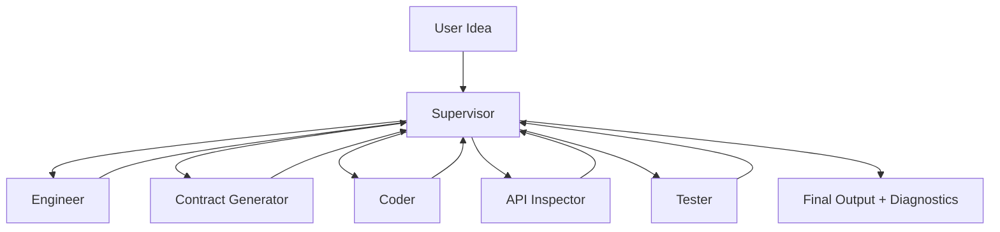

# MetaForge

[](https://opensource.org/licenses/MIT)
[](https://www.python.org/)
[]()
[]()
[]()

MetaForge transforms a natural language software idea into a runnable multi-module Python project using a coordinated team of LLM-powered agents. It is designed to **fail gracefully**: when the LLM cannot produce production-quality code, the system detects this and deliberatelyhalts the project, ensuring that no broken code is ever delivered.

### Why MetaForge?

Unlike simple AI wrappers that ask one model to generate an entire project, MetaForge introduces a structured software-engineering pipeline. The system decomposes the task into specialized agents (Supervisor, Engineer, Coder, and Tester) that collaborate through a message-passing architecture, now reinforced with a **Contract Layer** and an **API Inspector** to guarantee that every generated module implements exactly the public API it promised. This design prioritizes reliability, observability, and controlled failure over pure generation speed.

### How It Works


```mermaid
flowchart TD
    A[User Idea] --> B[Supervisor]
    B --> C[Engineer]
    C --> B
    B --> D[Contract Generator]
    D --> B
    B --> E[Coder]
    E --> B
    B --> F[API Inspector]
    F --> B
    B --> G[Tester]
    G --> B
    B --> H[Final Output + Diagnostics]
```

The fix loop attempts up to 3 times per module before stopping. The API Inspector acts as a quality gate: if a module's public API does not match its contract, it is blocked from testing and sent back for repair.

### Key Features

- **Multi-Agent Architecture**: Specialized agents (Supervisor, Engineer, Coder, Tester, API Inspector) collaborate through a message channel.
- **Contract-Driven Generation**: Before any code is written, the Engineer defines a strict public API for every module. The Coder is forced to implement exactly that API — no hallucinated function names or missing exports.
- **API Inspection Layer**: A dedicated agent parses generated Python files with ast and verifies that all exported functions and classes match the contract. Extra public symbols or kind mismatches (function vs. class) are caught before testing.
- **LLM-Powered Generation**: Uses real LLM calls to design and implement software projects.
- **Intelligent Fallback System**: Automatically detects LLM failures and gracefully terminates the process instead of producing broken code.
- **Built-in Diagnostic System**: Provides detailed step-by-step analysis when issues occur.
- **Context Awareness**: Coder knows what other modules already exist, preventing duplicated logic and broken imports.
- **Self-Repair Loop**: Debugger analyzes test failures, and the system attempts up to 3 targeted fixes per module before stopping. API Inspector failures also trigger the repair loop.
- **Learning from History**: Knowledge Base stores successful patterns and lessons from failures to improve future generations.
- **End-to-End Automation**: From idea to validated project with minimal human intervention.
- **Extensible Design**: Clean separation of concerns with dependency injection and modular components.

### Installation & Usage

```bash
git clone https://github.com/PyAimind/MetaForge.git
cd MetaForge

pip install -r requirements.txt
```

Create a `.env` file in the root directory:

```env
DEEPSEEK_API_KEY=your_api_key_here
LLM_BASE_URL=https://api.deepseek.com/v1/chat/completions
MAX_LLM_REQUESTS=40
LLM_ENGINEER_MODEL=deepseek/deepseek-chat-v3.1
LLM_CODER_MODEL=deepseek/deepseek-chat-v3.1
```

Run the system:

```bash
python main.py
```

### Example Runs (v3.1 — Real-World Validation)

| Project Idea | Result | Notes |
|---|---|---|
| A simple greeting app | ✅ Completed | Single module; contract generation and API Inspector verified module exports |
| Calculator with CLI that imports math_utils | ✅ Completed | Multi-module dependency scheduling and import handling validated |
| Todo list application with storage, models, CLI | ❌ Failed | Discovery: Cross-module API inconsistency detected at runtime. cli.py expected a class-based Storage API, but storage.py exported functions. Each module satisfied its own contract, but the contracts were not semantically compatible. This failure exposed a missing layer: signature-level enforcement. |

### Current Limitations (v3.1)

MetaForge v3.1 enforces that each module implements its declared public API (correct names and kinds). However, it does not yet validate parameter lists, types, or return values. As a result, two modules may individually pass inspection yet fail to work together because, for example, a class constructor expects different arguments than those provided by the caller. This limitation was discovered during end-to-end testing with the Todo application and is the primary target for v3.2.

Additional known limitations:

- The Tester can struggle with interactive `input()` or complex `argparse` usage that causes timeouts.
- The underlying LLM may occasionally ignore strict prompt constraints (e.g., adding forbidden imports).
- Semantic quality and architectural structure still depend heavily on the LLM’s current capabilities.

### Project Structure

```
MetaForge/
├── main.py
├── agents/
│   ├── supervisor.py
│   ├── engineer.py
│   ├── coder.py
│   ├── tester.py
│   └── api_inspector.py
├── communication/
│   ├── message.py
│   └── message_channel.py
├── workspace/
│   └── workspace_manager.py
├── project_design/
│   ├── structure_designer_llm.py
│   ├── code_generator_llm.py
│   ├── prompt_generator.py
│   ├── contract_generator.py
│   └── code_executor.py
├── llm_provider.py
├── memory/
│   └── knowledge_base.py
├── diagnostics/
│   ├── common.py
│   ├── diagnose.py
│   └── checks/
├── tests/
│   ├── test_phase18_integral.py
│   ├── test_phase18_generated_flag.py
│   ├── test_phase18_validated_flag.py
│   ├── test_api_inspector.py
│   └── test_phase19_supervisor_inspector_hook.py
├── output/                 # generated projects
├── requirements.txt
├── .env
└── config.py
```

### Roadmap

- ✅ **v1.0** — Simulated agents with mock responses
- ✅ **v2.0** — Full LLM-powered agents + Fallback + Diagnostics
- ✅ **v3.0-beta** — Context Manager, Debugger, Knowledge Base, Self-Repair Loop
- ✅ **v3.1** — Contract Generator, contract-aware Coder, API Inspector, Supervisor quality gate
- ⬜ **v3.2** — Signature-level contract enforcement (parameter & return type validation)
- ⬜ **v4.0** — Web UI

### Version History

- **v3.1** — Contract Layer, contracts.json, Contract-Aware Coder, API Inspector, Supervisor validation gate (July 2026)
- **v3.0-beta** — Context Manager, Debugger agent, Knowledge Base, Self-Repair Loop, multi-module coordination (July 2026)
- **v2.0** — Full LLM-powered agents with real API integration, fallback detection, and diagnostic system (July 2026)
- **v1.0** — Simulated agents with mock responses (June 2026)

### License

This project is licensed under the MIT License.
